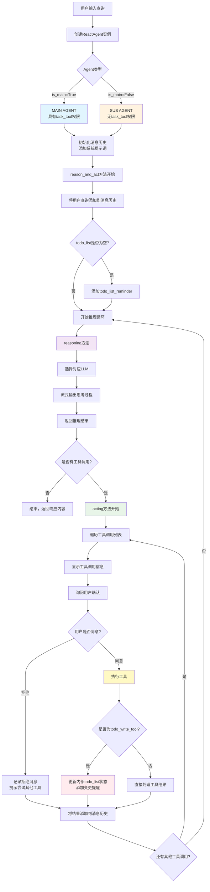

# Open Claude Code

一个参考 [claude-code-reverse](https://github.com/Yuyz0112/claude-code-reverse) 与 Claude Code 的教学项目

## 🎯 项目简介

本项目旨在通过**最小实现**的方式帮助开发者理解 Claude Code 的工作机制。通过分析和重现 Claude Code 的核心功能，为学习和研究 AI 代码助手的实现原理提供参考。

## ✨ 特点

- 📚 **教学导向**: 专注于理解 Claude Code 的核心工作机制
- 🎯 **最小实现**: 去除复杂性，保留核心逻辑
- 🌐 **开源友好**: 完全开源，欢迎学习和贡献
- 🔌 **OpenAI 兼容**: 支持 OpenAI 接口模型，易于部署和测试
- 🛠️ **工具丰富**: 实现了多种代码操作工具

## 🏗️ 项目结构

```
open-claudecode/
├── app/                    # 核心应用逻辑
│   ├── Agent.py           # AI 代理实现
│   └── LLM.py             # 大语言模型封装
├── tools/                 # 工具集合
│   ├── bashtool.py        # 命令行工具
│   ├── edittool.py        # 文件编辑工具
│   ├── greptool.py        # 代码搜索工具
│   └── ...                # 其他工具
├── prompt/                # 系统提示词
│   ├── system.py          # 系统提示词
│   └── system_reminder.py # 系统提醒
├── tests/                 # 测试用例
└── main.py               # 程序入口
```

## 🚀 快速开始

### 环境要求

- Python 3.8+
- 支持 OpenAI API 的模型服务

### 安装依赖

```bash
pip install -r requirements.txt
```

### 配置

1. 复制配置文件并修改：
```bash
cp .env.example .env
```

2. 在 `.env` 中配置您的 API 密钥和模型设置

### 运行

```bash
python main.py
```

## 🔧 核心功能

### AI 代理系统
- 基于大语言模型的智能代理
- 支持多轮对话和上下文管理
- 实现工具调用和结果处理

### 工具生态
- **文件操作**: 读取、编辑、创建文件
- **代码搜索**: 支持正则表达式和语义搜索
- **命令执行**: 安全的命令行操作
- **任务管理**: TODO 和任务跟踪

## 🏛️ 系统架构

### ReactAgent 运行机制流程图



### 核心组件说明

#### 1. Agent 类型
- **MAIN AGENT**: 具有完整工具权限，包括task_tool
- **SUB AGENT**: 受限工具权限，主要用于子任务执行

#### 2. 消息管理
- 维护完整的对话历史
- 包含系统提示词、用户消息、AI响应和工具执行结果
- 支持上下文连续性

#### 3. 工具执行流程
- **人机协作**: 每个工具调用都需要用户确认
- **状态管理**: 特殊处理todo_write_tool的状态更新
- **错误处理**: 用户拒绝时提供替代建议

#### 4. 循环机制
- **推理-执行循环**: 持续到没有新的工具调用
- **流式输出**: 实时显示AI思考过程
- **渐进式问题解决**: 通过多轮工具调用完成复杂任务

### 参考项目
- [claude-code-reverse](https://github.com/Yuyz0112/claude-code-reverse): 本项目的主要灵感来源
- Claude Code: Anthropic 官方代码助手

### 核心概念
1. **Agent 架构**: 理解 AI 代理的基本结构
2. **工具调用**: 学习如何让 LLM 使用外部工具
3. **上下文管理**: 掌握长对话的上下文处理
4. **提示词工程**: 了解有效提示词的设计原则

## 🤝 贡献

欢迎贡献代码、文档或提出建议！

1. Fork 本项目
2. 创建特性分支 (`git checkout -b feature/AmazingFeature`)
3. 提交更改 (`git commit -m 'Add some AmazingFeature'`)
4. 推送到分支 (`git push origin feature/AmazingFeature`)
5. 开启 Pull Request

## 🙏 致谢

- 感谢 [Yuyz0112](https://github.com/Yuyz0112) 的 claude-code-reverse 项目提供的宝贵洞察
- 感谢 Anthropic 团队开发的 Claude Code
- 感谢所有为开源 AI 工具发展做出贡献的开发者们

## 📞 联系

如有问题或建议，欢迎提交 Issue 或 Pull Request。

---

**免责声明**: 本项目仅用于教育和研究目的，不用于商业用途。请遵守相关服务的使用条款。
